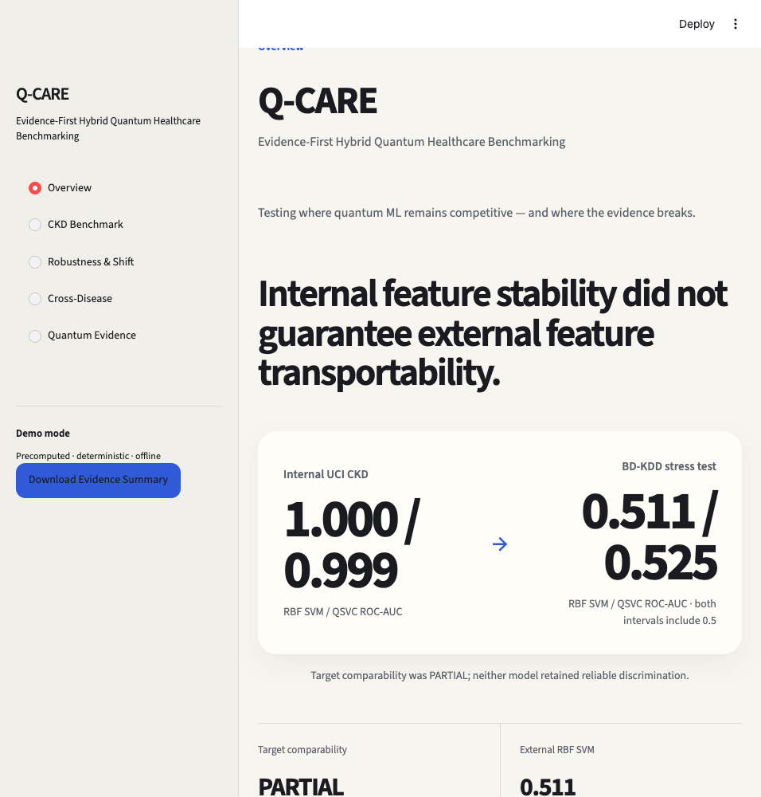

# Q-CARE

**Evidence-First Hybrid Quantum Healthcare Benchmarking Platform**

Q-CARE asks when quantum machine learning remains competitive with classical machine learning on biomedical classification data—and how that conclusion changes under feature reduction, missingness, measurement perturbation, distribution shift, and computational constraints.

It is a research benchmark, not a clinical screening product.

## Hackathon quick start

```bash
python3 -m venv .venv
source .venv/bin/activate
pip install -r requirements.txt
streamlit run app.py
```

### Demo mode

Open `http://localhost:8501`, then follow the fastest final route: **Overview → CKD Benchmark → Robustness & Shift → Quantum Evidence**. On those pages, use the rehearsed sections **Feature reduction → Classical vs quantum and runtime → External transportability → Final evidence summary**. The demo uses frozen artifacts, starts without expensive quantum retraining, and needs no IBM Quantum connection.

### Key finding

QSVC remained internally competitive at reduced CKD feature budgets, but it was hundreds of times slower and less robust than classical SVM. On the BD-KDD cross-cohort stress test, RBF SVM ROC-AUC was 0.511 [95% CI 0.475-0.546] and QSVC ROC-AUC was 0.525 [95% CI 0.489-0.561]. Both intervals included chance performance, their paired difference was not distinguishable, and target comparability was only **PARTIAL**.

**External transport failure reflected both target/cohort differences and changed feature–target relationships; therefore the experiment demonstrates transportability risk but cannot isolate pure conditional shift.**



The complete final-UI screenshot index is in [`submission/screenshots/README.md`](submission/screenshots/README.md). A no-live-app presentation path is in [`submission/demo_backup/README.md`](submission/demo_backup/README.md).

## Research question

Can a low-depth quantum-kernel support-vector classifier remain competitive with a classical RBF SVM at identical feature budgets, and does that result survive stress testing and dataset transfer?

## Why this matters

Small biomedical datasets can produce striking internal metrics that fail under deployment shift. Quantum ML demonstrations add further risks: unfair feature budgets, hidden simulator cost, overly complex circuits, and selective reporting. Q-CARE keeps positive and negative results visible together.

## Architecture

```text
Official datasets
      ↓
Provenance-aware cleaning and frozen splits
      ↓
Training-partition feature selection and preprocessing
      ↓
Matched RBF SVM ↔ QSVC benchmarks
      ↓
Robustness, transfer, runtime, and circuit evidence
      ↓
Frozen artifacts → results repository → Streamlit platform
```

The UI never retrains a quantum model. `src/results_repository.py` is the single display-data layer and reads only versioned experiment artifacts.

## Datasets

- [UCI Chronic Kidney Disease](https://archive.ics.uci.edu/dataset/336/chronic): 400 records and 24 predictors, reported from Apollo Hospitals, Karaikudi, Tamil Nadu, India.
- [BD-KDD](https://doi.org/10.7910/DVN/MB1LES): 988 records from Popular Diagnostic Centre, Savar Branch, Dhaka, Bangladesh; used as a frozen cross-cohort transport stress test with PARTIAL target comparability.
- [UCI Cleveland Heart Disease](https://archive.ics.uci.edu/dataset/45/heart%2Bdisease): 303 records and 13 predictors; methodology validation only.
- [Pima Indians Diabetes / OpenML 37](https://www.openml.org/d/37): 768 records and 8 predictors. It represents women of Pima heritage near Phoenix, Arizona and is not an Indian-population dataset.

## Experimental protocol

- Frozen 320-case CKD development partition and 80-case one-time locked test.
- Feature selection and preprocessing fitted inside training partitions.
- Identical feature budgets and folds for classical/quantum comparisons.
- Primary Phase 3 reference: stratified 5-fold cross-validation repeated 10 times.
- Predefined descriptive competitiveness tolerance: maximum 0.05 degradation across sensitivity, specificity, F1, and ROC-AUC.
- No robustness analysis or threshold choice uses the locked test.

## Key findings

- Stable 8-variable and 6-variable CKD signatures were retained.
- Eight-variable QSVC remained internally competitive within the predefined tolerance, but the classical SVM was slightly stronger across repeated resampling.
- QSVC was hundreds of times slower in local exact-statevector evaluation.
- Classical SVM was more robust to additional missingness and numeric perturbation.
- No QSVC small-sample advantage was observed.
- Neither frozen model demonstrated reliable better-than-random discrimination on BD-KDD.
- All eight internally predictive UCI feature-label associations flattened toward chance within BD-KDD.
- Internal feature stability did not guarantee external feature transportability.
- Heart methodology transfer was mixed; diabetes transfer was poor for QSVC.

## Internal CKD results

On development-only 5-fold CV repeated 10 times:

| Features | Model | Sensitivity | Specificity | F1 | ROC-AUC |
|---:|---|---:|---:|---:|---:|
| 8 | RBF SVM | 1.000 | 1.000 | 1.000 | 1.000 |
| 8 | QSVC | 0.985 | 0.980 | 0.986 | 0.999 |
| 6 | RBF SVM | 0.998 | 0.987 | 0.995 | 1.000 |
| 6 | QSVC | 0.977 | 0.978 | 0.981 | 0.995 |

Source: `artifacts/phase3/reference_cv_summary.csv`.

## Robustness

At 20% additional missingness, mean sensitivity was 0.962 for the classical SVM and 0.930 for QSVC. At the highest tested perturbation, prediction flip rates were approximately 0.2% and 0.9%, respectively. These are controlled simulations, not clinical-device validation.

## External transportability

The frozen UCI-development models were applied to BD-KDD without retraining. RBF SVM ROC-AUC was **0.511 [95% CI 0.475-0.546]** and QSVC ROC-AUC was **0.525 [95% CI 0.489-0.561]**. Their paired difference was **+0.0148 [95% CI -0.0292 to +0.0581]**. Neither model demonstrated reliable better-than-random discrimination, and no external classical-versus-quantum difference was established.

Target comparability was **PARTIAL**. All eight signed within-BD-KDD univariate feature AUCs included 0.5, despite strong UCI associations. Serum-creatinine medians were 2.25/0.90 mg/dL for UCI CKD/non-CKD and 7.71/7.10 mg/dL for BD-KDD CKD/non-CKD. This is a transportability stress-test failure, not clean proof of pure conditional shift or like-for-like clinical validation.

## Cross-disease validation

Cleveland’s eight-variable QSVC was close on sensitivity and ROC-AUC but missed the full tolerance on specificity. Pima QSVC sensitivity was 0.043 with ROC-AUC 0.653 and was not competitive. Metrics are never averaged across diseases.

## Quantum configuration

- QSVC with fidelity quantum kernel
- `ZFeatureMap`, one repetition
- No entanglement
- 8 qubits primary; 6 qubits secondary
- Logical circuit depth 2
- Classifier `C=0.5`

More complex feature maps did not produce better evidence in this experiment. This does not establish a general result about circuit entanglement.

## Runtime limitations

In the Phase 2 matched CV benchmark, QSVC training was approximately 464× slower at eight variables and 477× slower at six. Execution used exact local statevector kernel evaluation and does not demonstrate quantum-hardware speed-up.

## Responsible-use limitations

Q-CARE is not intended for diagnosis, treatment, clinical decision-making, or patient triage. Limitations include a small single-site primary dataset, missing values, unusually high internal metrics, partial external target comparability, no prospective validation, and no real quantum-hardware evaluation.

## Installation

```bash
python3 -m venv .venv
source .venv/bin/activate
pip install -r requirements.txt
```

## Run locally

```bash
streamlit run app.py
```

The deterministic demo loads precomputed artifacts, works offline after dependencies/data are installed, and does not require IBM Quantum connectivity.

## Tests

```bash
pytest -q
```

Tests cover data cleaning, split isolation, classical and quantum experiment integrity, external mappings, artifact-to-UI consistency, claim validation, circuit metadata, prohibited copy, and experiment replay.

The post-redesign validation passed **63 tests**. See [`research/post_ui_validation.md`](research/post_ui_validation.md), [`submission/screenshot_validation.md`](submission/screenshot_validation.md), and [`submission/accessibility_check.md`](submission/accessibility_check.md).

## Reproducibility

- Phase runners: `scripts/run_phase1.py`, `scripts/run_phase2.py`, `scripts/run_phase3.py`, and the post-freeze diagnostic runner `scripts/run_phase3c.py`.
- Frozen model identity and hashes: `artifacts/final_model_manifest.json`.
- Display claim registry: `artifacts/claim_registry.json`.
- Phase 4 display repository: `src/results_repository.py`.
- The locked-test artifact hashes are carried forward unchanged in the final manifest.

## References

See `research/references.md`, `reports/data_provenance.md`, `reports/validation/external_dataset_audit.md`, and the authoritative dataset links above.
