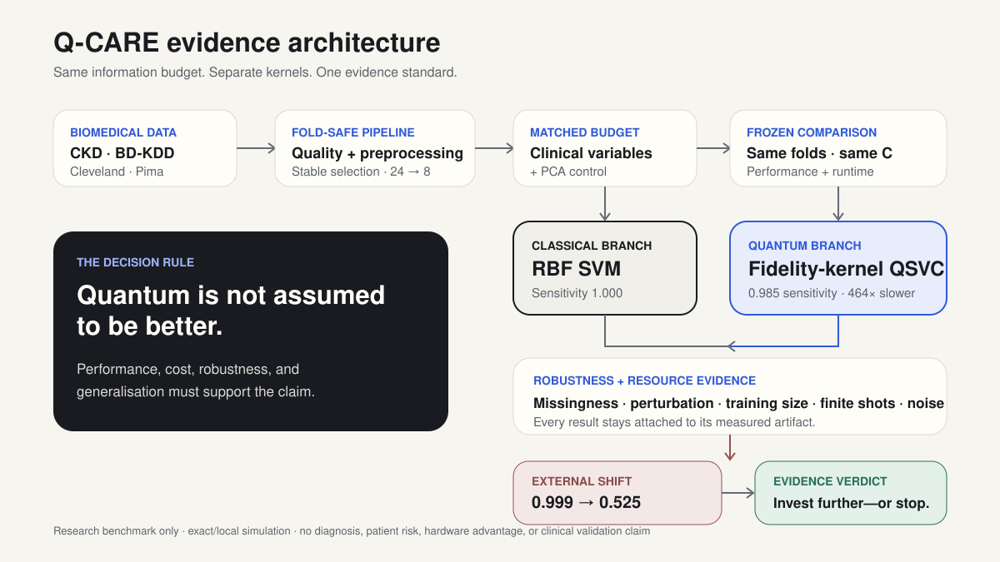
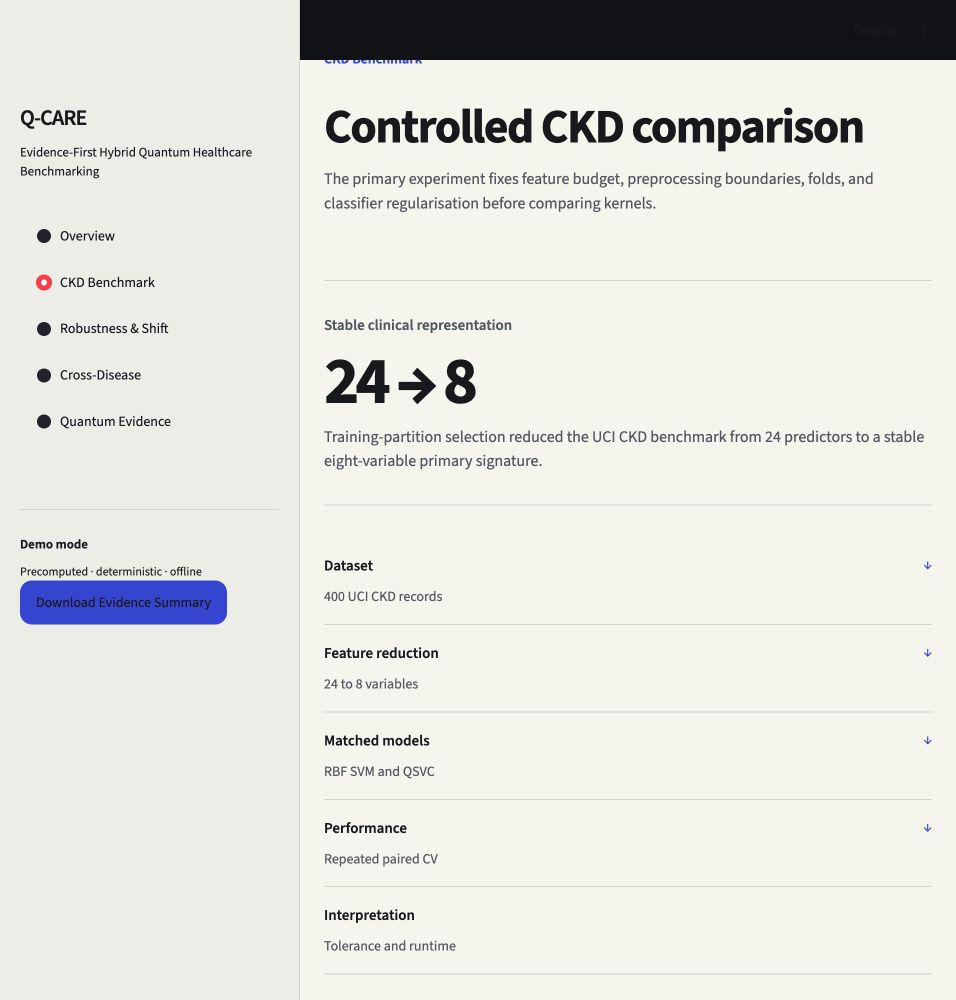
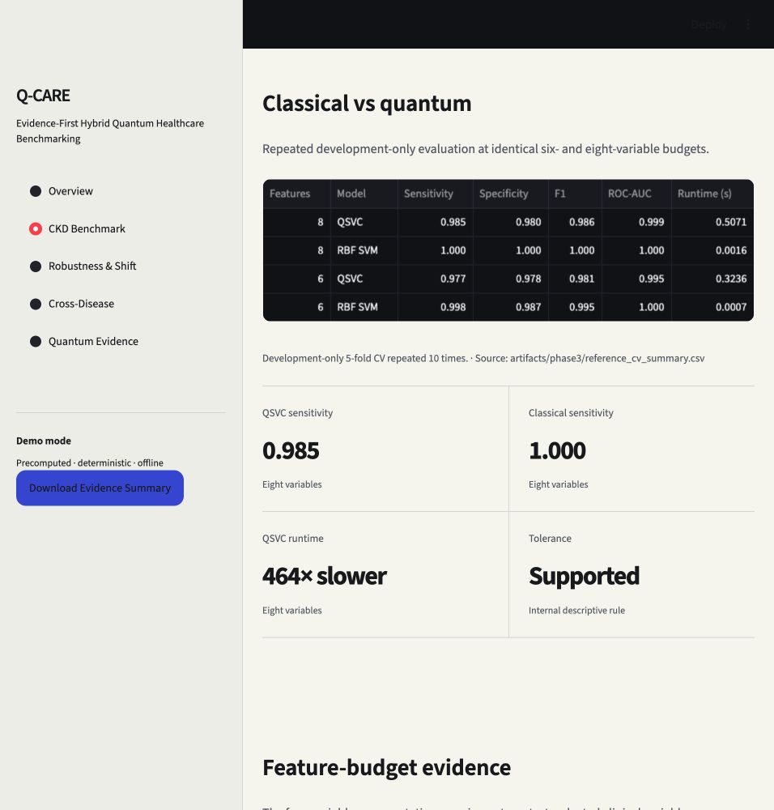
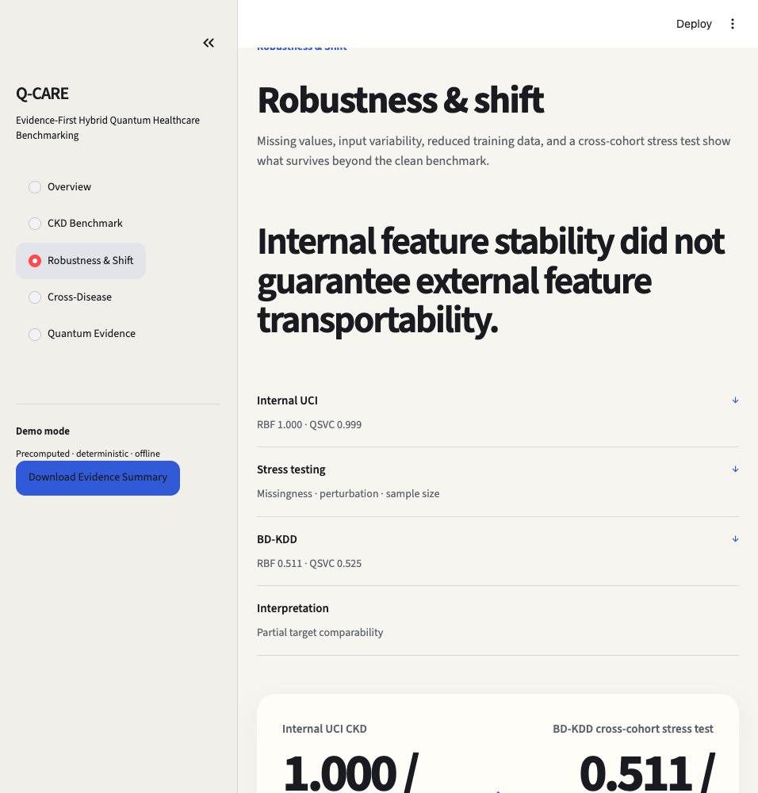
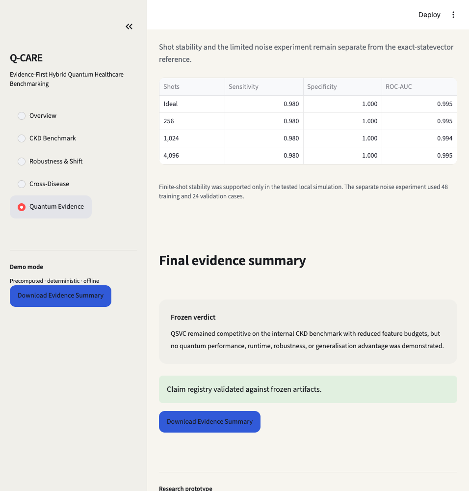
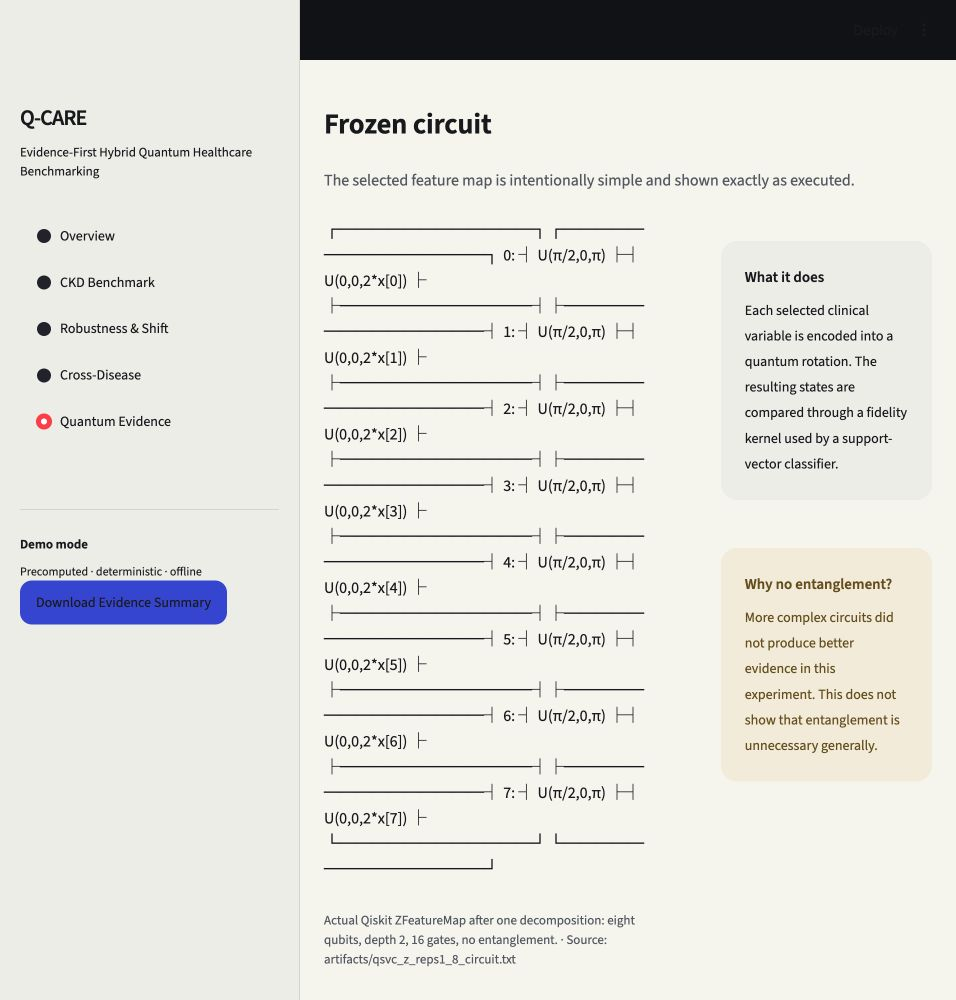

# Q-CARE Offline Demo Backup

This folder is sufficient to present the complete story without Streamlit or network access. Use the numbered files in order.

## One-line pitch

**Q-CARE is an evidence-first hybrid quantum healthcare benchmark that gives classical SVM and QSVC the same feature budget—and reports when neither model transports.**

## 1. Hook — internal success did not travel

“Internal RBF SVM/QSVC ROC-AUC was 1.000/0.999. On BD-KDD it was 0.511/0.525; both intervals included chance, and the paired difference included zero.”

## 2. Architecture — why the comparison is credible

“Preprocessing and feature selection are fold-safe; classical SVM and QSVC receive the same features and folds; robustness and shift are tested before the verdict.”

## 3. CKD benchmark — stable feature budget

“The primary CKD representation moved from 24 predictors to eight stable variables.”

## 4. Fair comparison and runtime

“QSVC sensitivity was 0.985 versus 1.000 for RBF SVM. It remained internally competitive, but exact statevector QSVC was about 464 times slower.”

## 5. Cross-cohort transport reveal

“Neither the classical SVM nor QSVC demonstrated reliable better-than-random discrimination on BD-KDD, and their external AUC difference was not statistically distinguishable.”

The root-cause evidence shows partial target comparability and flattening of the eight feature–target relationships. External transport failure reflected both target/cohort differences and changed feature–target relationships; therefore the experiment demonstrates transportability risk but cannot isolate pure conditional shift.

## 6. Final evidence verdict

“Q-CARE did not demonstrate quantum advantage. It demonstrated the evidence needed to decide where quantum merits further study—and where it does not.”

## Optional quantum explanation

The executed feature map used eight qubits, logical depth two, 16 gates after decomposition, and no entanglement. It is a fidelity quantum-kernel implementation, not a demonstrated computational advantage.

## Presenter files

- `demo_script_60sec.md` — timed emergency narration.
- `final_pitch.txt` — copy-safe one-line pitch.
- `../demo_script_2min.md` — complete live or offline two-minute route.
- `../screenshot_pitch_mapping.md` — pitch moment to evidence mapping.

## Recovery rule

Do not improvise stronger claims. Treat this as a shared cross-cohort transportability failure, never as a failure unique to QSVC. Every displayed number is validated in `../screenshot_validation.md`.
