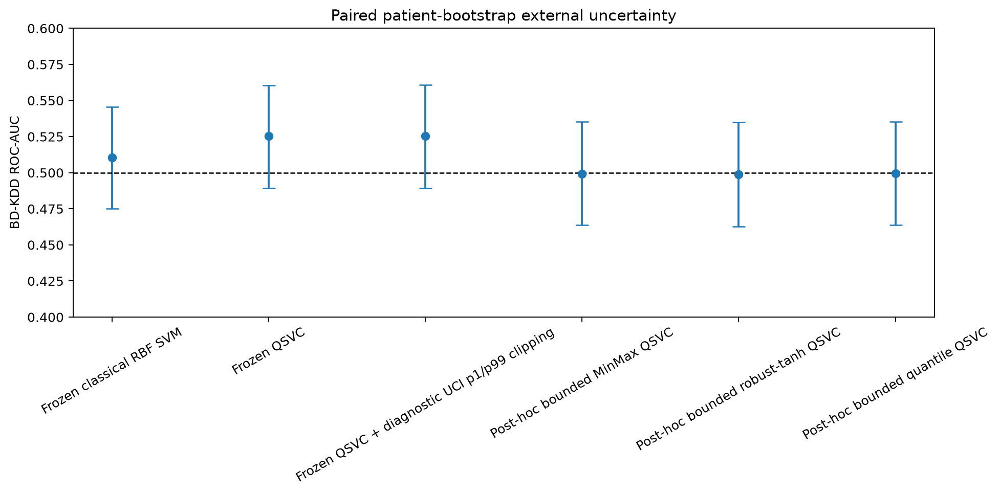
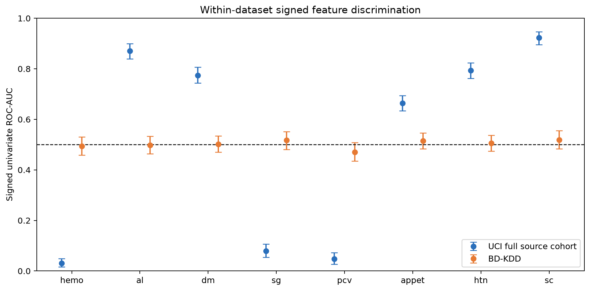
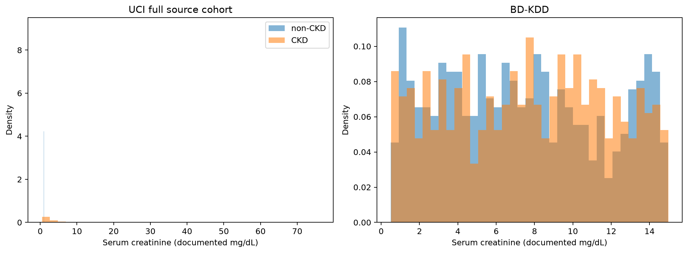

# Q-CARE

## A layman's handbook to evidence-first quantum healthcare benchmarking

**Final Phase 3D edition - 25 August 2026**

Q-CARE asks a deliberately difficult question: when a quantum machine-learning model looks strong on a biomedical benchmark, does that result survive fair comparison, compute accounting, stress testing, and a new cohort?

The answer in this project is nuanced. QSVC was competitive inside one controlled CKD benchmark, but it was much slower than a matched classical model and did not retain useful discrimination in a second cohort. The second-cohort failure was shared by both models and cannot be assigned to one pure mechanism.

> Research benchmark only. Q-CARE is not a diagnostic, screening, treatment, triage, or patient-risk system.

<!-- PAGEBREAK -->

## 1. What Q-CARE actually does

Q-CARE compares a classical radial-basis-function support-vector machine (RBF SVM) with a quantum-kernel support-vector classifier (QSVC). The comparison fixes the information budget, folds, preprocessing boundaries, and regularisation before measuring performance.

It then asks five evidence questions:

- Was the internal comparison fair?
- Did the feature signature remain stable inside the development cohort?
- How much computation did each method require?
- Did the result survive missingness, perturbation, and less training data?
- Did the learned relationships transport to another cohort?

Q-CARE keeps positive, negative, and inconclusive evidence together. It does not compress them into a promotional score.

## 2. The controlled internal result

The primary dataset is the UCI Chronic Kidney Disease benchmark: 400 records and 24 predictors. Training-partition selection produced an eight-variable signature:

`hemo`, `al`, `dm`, `sg`, `pcv`, `appet`, `htn`, `sc`.

| Model | Internal UCI sensitivity | Internal UCI ROC-AUC | Interpretation |
|---|---:|---:|---|
| RBF SVM | 1.000 | 1.000 | Matched classical reference |
| QSVC | 0.985 | 0.999 | Internally competitive within the predefined descriptive tolerance |

The QSVC result is a narrow internal benchmark finding. It does not establish superiority, clinical non-inferiority, or patient usefulness. Exact local statevector QSVC training was about 464 times slower at eight variables.

<!-- PAGEBREAK -->

## 3. The BD-KDD transport stress test

Both frozen models were applied to BD-KDD without feature reselection, recalibration, or retraining.

| Model | BD-KDD ROC-AUC | 95% bootstrap interval | Assessment |
|---|---:|---:|---|
| RBF SVM | 0.511 | 0.475-0.546 | Indistinguishable from random discrimination |
| QSVC | 0.525 | 0.489-0.561 | Indistinguishable from random discrimination |

The paired QSVC-minus-SVM difference was +0.0148, with a 95% interval from -0.0292 to +0.0581. Because the interval includes zero, the small point-estimate difference is not evidence that QSVC performed better.

**Statistical finding:** Neither the classical SVM nor QSVC demonstrated reliable better-than-random discrimination on BD-KDD, and their external AUC difference was not statistically distinguishable.

<!-- PAGEBREAK -->

## 4. Why the team investigated quantum angles

The selected quantum feature map converts scaled feature values into rotation angles. Periodic quantum rotations can sometimes map different numerical values to similar states. This made angle aliasing and state collision plausible failure hypotheses.

The audit tested those hypotheses directly:

- The analytic kernel matched the persisted Qiskit fidelity kernel to numerical precision.
- No representative high-distance pair produced a high-fidelity whole-state collision under the preregistered threshold.
- Clipping values did not materially change AUC.
- Three bounded encodings also remained around chance discrimination.

The quantum kernel did lose label separation, but not because gross state collisions were demonstrated. The classical RBF kernel independently lost label separation too. The external failure was therefore shared, not quantum-specific.

## 5. Target comparability came first

The UCI source names `ckd` and `notckd` classes but does not publish its diagnostic assignment rule. BD-KDD documents physician/laboratory-based `kidney disease` and `healthy` labels, but does not publish equivalent CKD chronicity, staging, eGFR, or time criteria.

| Cohort | Total | Positive | Negative | Positive prevalence |
|---|---:|---:|---:|---:|
| UCI CKD | 400 | 250 | 150 | 62.50% |
| BD-KDD | 988 | 507 | 481 | 51.32% |

Target comparability is therefore **PARTIAL**. BD-KDD is useful as an independent cross-cohort stress test, but it is not established as clean like-for-like clinical external validation.

<!-- PAGEBREAK -->

## 6. Internal stability versus external transportability

ROC-AUC measures ranking. A value near 0.5 means weak ranking signal. A value far below 0.5 can still mean strong discrimination in the opposite direction, so signed AUC values must not be automatically flipped.

All eight features had strong signed associations in UCI. Every within-BD-KDD bootstrap interval included 0.5.

**Secondary finding:** Internal feature stability did not guarantee external feature transportability.

A positive unit conversion, standardisation, or min-max transform preserves ranking. Such monotonic scaling cannot restore ranking information that is absent inside the external cohort. A non-monotonic transform can change rankings, but that would be a different modelling hypothesis rather than a simple unit repair.

<!-- PAGEBREAK -->

## 7. Creatinine as the clearest layman example

| Label | UCI median serum creatinine | BD-KDD median serum creatinine |
|---|---:|---:|
| CKD | 2.25 mg/dL | 7.71 mg/dL |
| non-CKD | 0.90 mg/dL | 7.10 mg/dL |

Imagine training a model where creatinine clearly separates two groups. In a second dataset, both groups have almost the same creatinine values. The model cannot recover information that is no longer present in the inputs.

These values suggest a substantially different renal-function cohort or label/cohort construction. They do not establish CKD stage, and Q-CARE does not infer stage from creatinine alone.

<!-- PAGEBREAK -->

## 8. The final external interpretation

**External transport failure reflected both target/cohort differences and changed feature-target relationships; therefore the experiment demonstrates transportability risk but cannot isolate pure conditional shift.**

This sentence has four important safeguards:

- `Both models`: the failure is not presented as quantum-specific.
- `Target/cohort differences`: target equivalence was not established.
- `Changed feature-target relationships`: all eight signed feature associations flattened.
- `Cannot isolate`: the available evidence cannot apportion cause among target construction, case mix, measurement practice, or record construction.

The audit also ruled out label inversion, scaler overflow, simple clipping repair, bounded-encoding repair, and gross quantum-state collisions as dominant explanations.

## 9. What Q-CARE can and cannot claim

### Supported

- QSVC was internally competitive within the tested UCI feature budgets and predefined descriptive tolerance.
- Exact statevector QSVC was hundreds of times slower in the measured local benchmark.
- Classical SVM was more robust in the tested missingness and perturbation settings.
- Neither frozen model retained reliable BD-KDD discrimination.
- Internal feature stability did not guarantee external feature transportability in this experiment.

### Not supported

- Quantum superiority or acceleration.
- QSVC external superiority.
- Like-for-like clinical external validation.
- Pure conditional shift as the single proven cause.
- Diagnosis, calibrated patient risk, cost savings, or deployment readiness.

<!-- PAGEBREAK -->

## 10. Future work: transportability-aware feature selection

Future Q-CARE studies should establish transportability before the final model-family comparison:

1. Identify external cohorts before model development.
2. Harmonise target definitions.
3. Harmonise units and measurement protocols.
4. Identify semantically and operationally common features across sites.
5. Select features for cross-site transportability, not internal performance alone.
6. Use multi-site development data.
7. Perform leave-one-site-out validation.
8. Reserve a final untouched external cohort.
9. Only then compare classical and quantum models.

**Transportability-aware feature selection** would favour variables whose definitions, measurement processes, availability, and label relationships remain sufficiently stable across development sites. It is a future research concept, not an implemented claim in this frozen project.

## 11. Evidence map

- Target definitions: `reports/root_cause/target_definition_audit.md`
- Per-label distributions: `reports/root_cause/per_label_feature_profiles.md`
- Signed feature AUC: `reports/root_cause/univariate_auc.md`
- Model uncertainty: `reports/root_cause/external_auc_bootstrap.md`
- Quantum kernel information: `reports/root_cause/kernel_information_content.md`
- Classical geometry: `reports/root_cause/classical_geometry.md`
- Final interpretation: `research/phase3d_external_interpretation_freeze.md`
- Future protocol: `research/phase3d_future_work.md`

Q-CARE's value is not that quantum won. Its value is that the evidence made an unsupported quantum or clinical claim difficult to hide.
